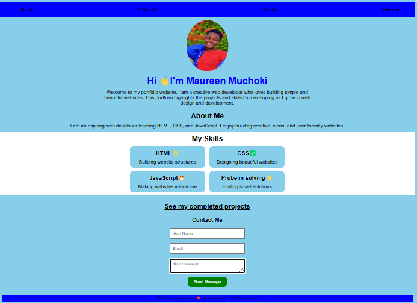
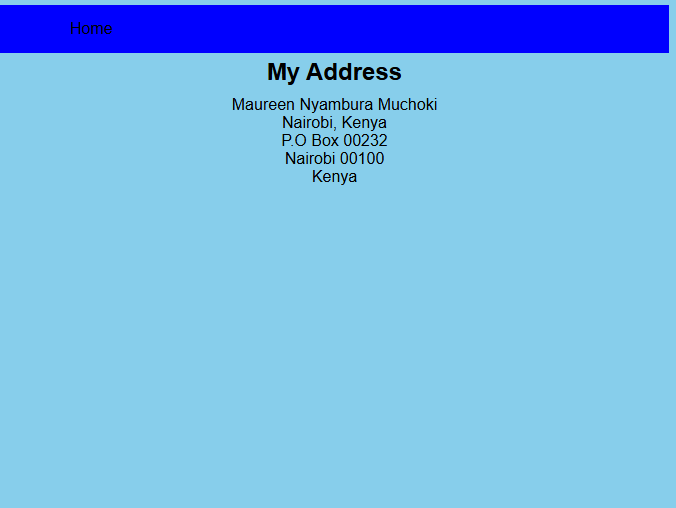
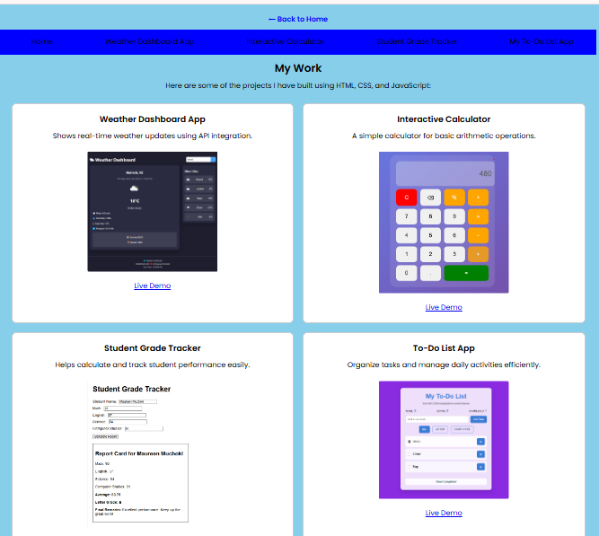

# Week 2: CSS Mastery

## Author
- **Name:** Maureen Muchoki  
- **GitHub:** [@Maureenmuchoki](https://github.com/maureenmuchoki-hub)  
- **Date:** March 21, 2026  

## Project Description
This project focuses on mastering CSS3 by building a responsive and visually appealing portfolio website. It includes modern layout techniques such as Flexbox and CSS Grid.

## Technologies Used
- HTML5  
- CSS3  
- JavaScript  

## Features
- Responsive design (mobile-first)
- Flexbox navigation layout
- CSS Grid image gallery
- Styled typography using Google Fonts
- Interactive contact form
- Popup message feature

## How to Run
1. Clone this repository:
   ```bash
   git clone https://github.com/maureenmuchoki-hub/iyf-s10-week-02-Maureenmuchoki.git
2. Open index.html in your browser
OR
Run locally with a live server extension (e.g., VS Code Live Server)

## Lessons Learned
- Deepened understanding of the CSS box model, including padding, border, and margin
- Implemented responsive layouts using CSS Grid and Flexbox
- Applied mobile-first design principles
- Learned to create consistent typography and color systems using CSS variables
- Practiced creating reusable project card components

## Challenges Faced
- Aligning project cards in a clean 2×2 layout on tablets while keeping mobile and desktop responsiveness
- Resizing images so they look neat without stretching the card
- Ensuring consistent spacing and hover effects across all interactive elements
- Debugging margin/padding issues that affected the box model layout

## Screenshots (optional)






## Live Demo
[View Live Demo](https://maureenmuchoki-hub.github.io/iyf-s10-week-02-Maureenmuchoki/)
